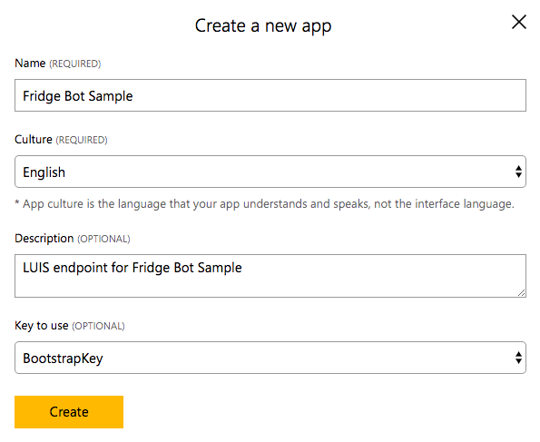
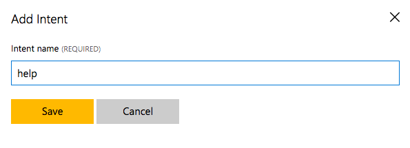
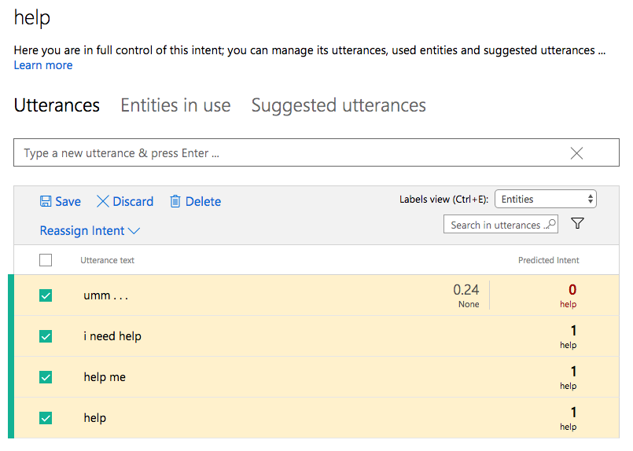
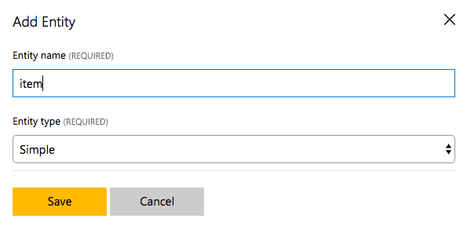
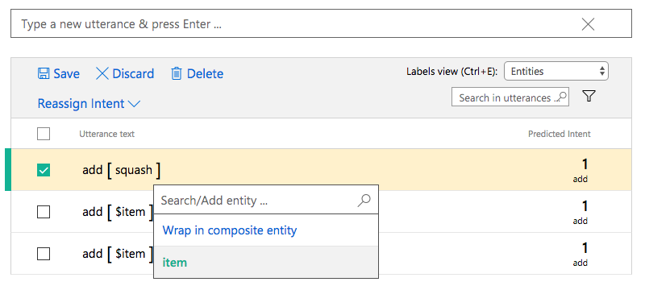
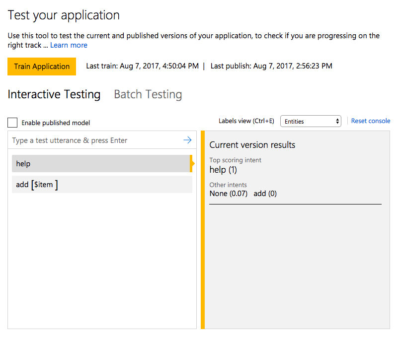

# Fridge Sample

## Description
Fridge is a bot that helps you to manage refrigerator inventory. You can add or delete an item or see or clear the inventory of your fridge. The bot uses LUIS (Language Understanding Intelligent Service) Cognitive Service to recognize your intents so that you can talk to the bot as if you are talking to a person. This sample bot will serve as a good example of incorporating natural language processing service to Skype bots.

## Bot Demo
To add the Fridge to your Skype account, click [here](https://join.skype.com/bot/b99fd107-6b43-449c-bdd2-7552190c9978).

## How it Works
- The LUIS service associated with this sample bot can understand six different intents: None, add, clear, help, remove and show. It has one entity named item, which is associated with add and remove intents. Each of the intents triggers an action associated with that intent and the action performs necessary operation and ends the dialog.
- Data that contains saved items is kept track of with userData for simplicity of the sample bot.
- The app listens for user activities from *MessageController* in the *Post* method and hands over the messages to the *IntentDialog* if the incoming activity is of type message.
- *IntentDialog* that derives from *LuisDialog*, then triggers the corresponding method when it recognizes the intent.

```
[LuisIntent("add")]
public async Task Add(IDialogContext context, LuisResult result)
{
    EntityRecommendation itemToAdd;
    if (!result.TryFindEntity("item", out itemToAdd))
    {
        await context.PostAsync(Text.NotYetSupported);
        context.Wait(MessageReceived);
    }
    else
    {
        Util.AddToFridge(context, itemToAdd.Entity);
        await context.PostAsync(string.Format(Text.Added, itemToAdd.Entity));
        context.Wait(MessageReceived);
    }
}
```
- Let's look at the 'Add' dialog above, for the 'add' intent. When the LUIS understands the user's intent as 'add', this dialog will be triggered. The 'Add' dialog then, tries to find the 'item' entity which is the item that the user wants to put into the fridge. It uses the *result.TryFindEntity()* to check whether entity of name "item" exists. If the entity "item" exists in the result, the dialog calls the helper function *Util.AddToFridge()* to put the item into the fridge and finally, sends a notification message back to the user.

## Do It Yourself (Deploy the Bot Sample)
In this section, we will go over how to deploy this Fridge Bot sample from start to end.

#### Prerequisites
Set up the environment for your bot as described [here](https://docs.microsoft.com/en-us/bot-framework/dotnet/bot-builder-dotnet-quickstart). Install Visual Studio 2017 for Windows and update all extensions. Download the Bot Application, Bot Controller, and Bot Dialog templates and install it as instructed.

#### Create a LUIS Application
This Fridge Bot Sample uses Language Understanding Intelligent Service, or, LUIS, to understand user's intents. Learn more about LUIS [here](https://docs.microsoft.com/en-us/azure/cognitive-services/LUIS/Home). Let's create a new LUIS Application for your Fridge Bot.

1. Create a new application <br />
 <br />
Sign into [LUIS website](https://www.luis.ai) and go to **My Apps** tab. Click on **New App** button to create a new LUIS app. On the **Dashboard**, locate the App Id, and make a note of it. It will be used to update configurations in the later step.

2. Add a new intent <br />
 <br />
Intents represent the actions that the user wants to perform. For this sample bot, your LUIS app will need to handle six different intents: None, add, clear, help, remove and show. To add a new intent, locate to your LUIS app and click on **Intents** on the left panel. Click on **Add Intent** button and type in the name of the intent you want to create. Here, we are creating the help intent.

3. Enter utterances <br />
 <br />
Utterances are textual input from the user. After creating an intent, you can add expected utterances to the intent. Don't forget to hit **Save** button after adding utterances.

4. Add a new entity <br />
 <br />
Entities represent the object that is relevant to the intent. For example, for the utterance "add an apple", "add" is the intent and "apple" is the entity. For some intents such as "help", entites are not required. However, for some intents like the "add" example, entities are necessary. For this sample bot, your LUIS app will need to handle one custom simple entity, called item. To create a new entity, click on **entities** on the left panel and click on **add entity** button.

5. Label entity in utterances <br />
 <br />
Locate to the intent where entities are need to be labeled. For example, "add" intent needs an entity. Click on the word that you want to label as an entity for the utterances and select type of the entity that you want to label it to.

6. Train, test and publish the app <br />
 <br />
At this point, you have first, added six intents (None, add, clear, help, remove and show), second, added one entity (item), and third, added many utterances to each of the intents and correctly labeled the entities for each of the utterances. Now, you have to train the app with the information you provided. Go to the **Train & Test** from the left panel and click on the **Train Application** button to train your app. You can then test the model by typing in a test utterance. Then, go to the **Publish App** and click on **Publish** button to publish your app. The endpoint url for your LUIS app will be created. From the **Publish App** tab, locate the Endpoint Key and make a note of it. For example, if you are using the experimental key, the name of the key will be "BootstrapKey". You can create and add a new Azure key to your account. If so, make a note of its domain with the key itself.

#### Register the Sample Bot
Register the sample bot following this [link](https://docs.microsoft.com/en-us/bot-framework/portal-register-bot), and make a note of the Microsoft App ID and Password to update the configurations of your bot.

#### Update Configurations
- In Web.config file, replace $MicrosoftAppId$ and $MicrosoftAppPassword$ with values obtained during the bot registration from the previous step. Also, replace $BotId$ with what you want your bot Id to be. Conventionally, Bot Id is set to "28:$MicrosoftAppId$".
```
<appSettings>
    <!-- update these with your BotId, Microsoft App Id and your Microsoft App Password-->
    <add key="BotId" value="$BotId$" />
    <add key="MicrosoftAppId" value="$MicrosoftAppId$" />
    <add key="MicrosoftAppPassword" value="$MicrosoftAppPassword$" />
</appSettings>
```
- In line 12 of IntentDialog.cs, replace $MicrosoftLUISAppId$ and $MicrosoftLUISSubscriptionKey$ with the values obtained while creating a LUIS application. $MicrosoftLUISAppId$ which is the LUIS App Id, can be found in **Dashboard**. $MicrosoftLUISSubscriptionKey$ is the endpoint key, which will be "BootstrapKey" if you did not create a new Azure key for this LUIS app.
```
[LuisModel("$MicrosoftLUISAppId$", "$MicrosoftLUISSubscriptionKey$")]
```
- If you have created a new Azure key for the LUIS app with the specific domain which is not West US, you will have to add another argument for LuisModel attribute as follows. Replace $MicrosoftLUISSubscriptionDomain$ with the domain of your subscription key. For example, if the domain is Southeast Asia, replace $MicrosoftLUISSubscriptionDomain$ with "southeastasia.api.cognitive.microsoft.com". Refer to [this document](https://docs.microsoft.com/en-us/bot-framework/dotnet/bot-builder-dotnet-luis-dialogs#regions-and-keys) about region and keys for more information.
```
[LuisModel("$MicrosoftLUISAppId$", "$MicrosoftLUISSubscriptionKey$", domain: "$MicrosoftLUISSubscriptionDomain$")]
```

#### Deploy the bot to the cloud
Prerequisites and instructions for deploying the bot are [here](https://docs.microsoft.com/en-us/bot-framework/deploy-bot-overview). After deploying the bot, you can add your bot as a contact by using its join link. You can access the bot's join link from Microsoft Bot Framework, by clicking on your bot and clicking on the **Skype** in Connect to channels tab.


## More Information
To get more information about the Microsoft Bot Framework and LUIS, please review the following resources:
- [Bot Builder SDK for .NET](https://docs.microsoft.com/en-us/bot-framework/dotnet/bot-builder-dotnet-overview)
- [Add intelligence to bots with Cognitive Services](https://docs.microsoft.com/en-us/bot-framework/cognitive-services-bot-intelligence-overview#language-understanding)
- [Learn about Language Understanding Intelligent Service(LUIS)](https://docs.microsoft.com/en-us/bot-framework/cognitive-services-bot-intelligence-overview#language-understanding) <br /> <br />